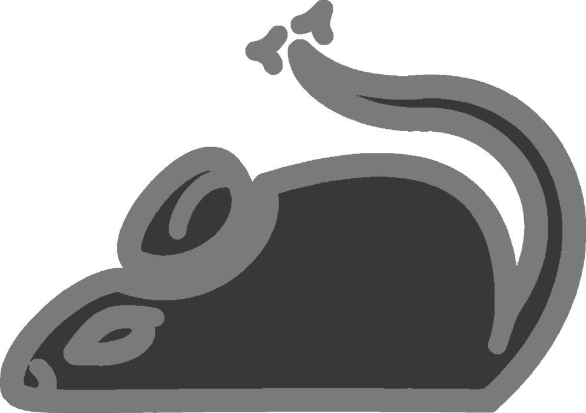

# Mousr

Move mouse cursor with keyboard!

BETA VERSION (uncompiled) OUT NOW!

`[report bug]`

Pronounced /maʊsɚ/

Now written in AutoHotKey!

# How to use

## Installation

`[installation]`

## Controls

`[controls]`

# Contributing

`[contributing]`

> Created by [darcy](https://github.com/darccyy)

# TODO

- [ ] Read shortcuts file
- [ ] Rename vars
- [ ] Compile
- [ ] Test
- [ ] Survey
